# Provenance templates for the Credit Card Assessment scenario

## Credit application

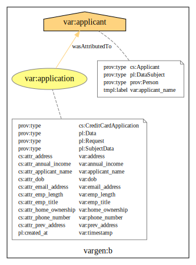

## Credit search

### Applicant's identifier for credit search

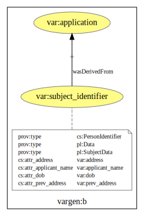

### Credit report

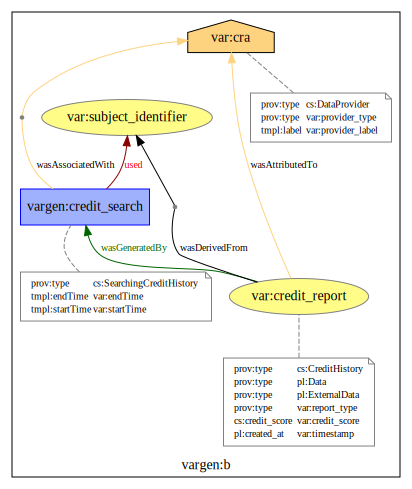

### An individual record included in a report

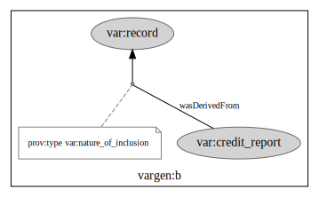

### Credit payment record

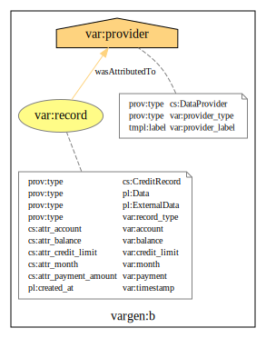

### Linked address record

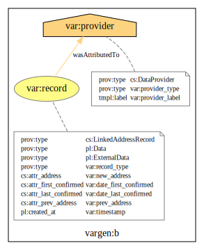

### Electoral register record

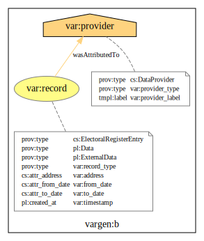

## Processing of a credit application

### The overall process

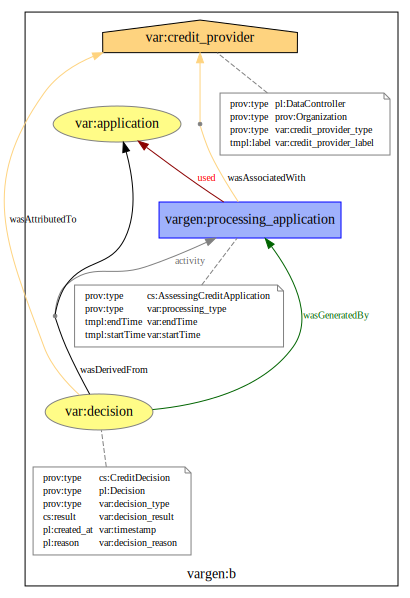

### Machine recommendation

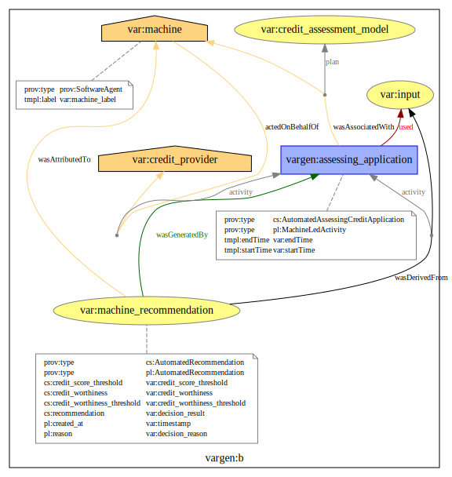

### Automated decision

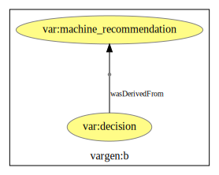

### Human decision after a review

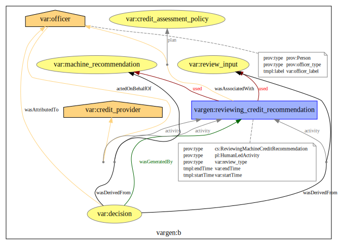
