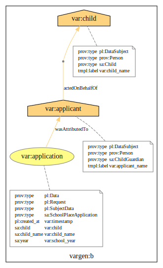
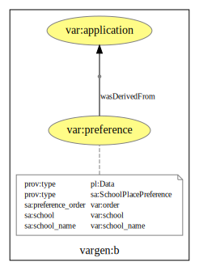
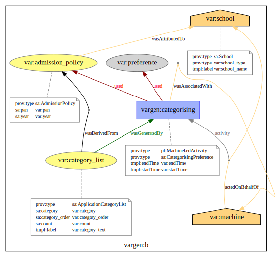
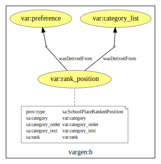
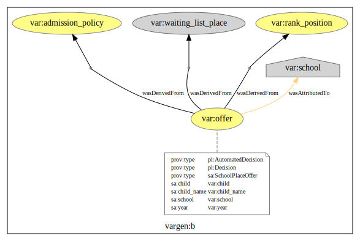
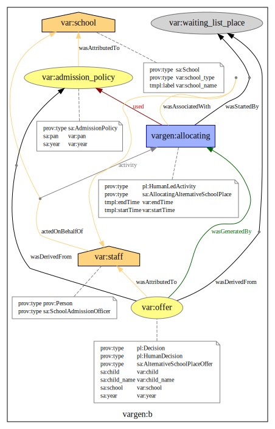
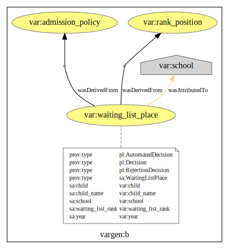

# Provenance templates for the School Allocation scenario

## An application for a school place

### A preference for a school

## Processing of a school application

### Categorising

### Ranking

### An offer

### An alternative offer

### A waiting list

